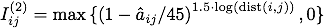
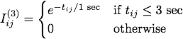

!SLIDE center small
# Interest Sets #
* Only send deep information about interests
* Maintain interest set by sending _subscribe_ packets
  to interests when they become interesting and
  _unsubscribe_ when they leave
* Define interests as weighted sum of interest metrics
    * _Proximity_ 
    * _Aim_ 
    * _Interaction Recency_ 

!SLIDE bullets
# Interest Weighting #
* each metric has different units so it needs different weights
* e.g., snipers don't care about proximity
* see workshop paper for more info
