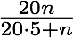

!SLIDE
# Doppelgänger and messaging#

!SLIDE
* AI bot uses guidance to move to locations smoothly
* All players update non-interested players with "guidance" for 
their doppelgängers once every second
* New growth factor: 
* Low bandwidth peers are balanced by high capacity peers

!SLIDE center
## Effect of forwarding on latency ##

<n% = message goes through forwarder in the <n% quartile

!SLIDE bullets incremental comment
* Forwarding multicast tree is based on sources
* Trees are short-lived and probabalistic
* The forwarding pool is chosen at the beginning of the game by
peers that have latency and bandwidth above a threshold
* A byte in guidance packets updates peers to their forwarding
capacity (half of total to prevent queuing delay and collisions)
* collision likelihood is reduced by increasing capacity
    * ###### would have liked to see some math here ######

!SLIDE command
# Guidance #

!SLIDE center comment smbullets smaller
# Forwarding #
* _fan-in_ = number of sources it can forward for

* s = guidance size
* p = guidance period
* b = rate limit
* r = bandwidth set aside for non-guidance
* n = player count
* h = header size

* Wait for 3s timeout on guidance timeout to detect forwarder
    drop-out
    * ###### 3s is a long time, does no one really notice? ######
