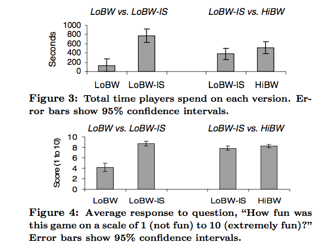
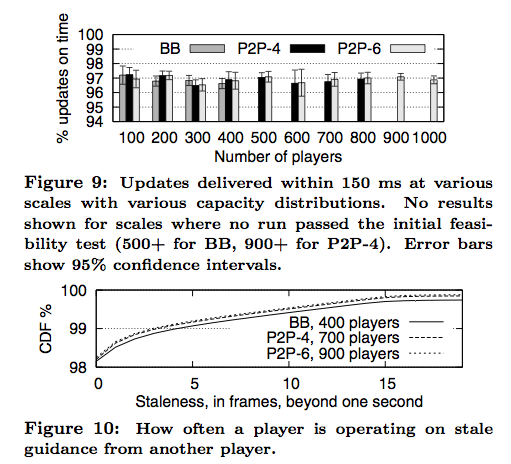

!SLIDE smbullets center
## UX Testing ##
* tested 3 scenarios: LoBW, LoBW-IS, HiBW
* LoBW-IW has subscriber set size = 4
* 

!SLIDE full-size center
# Network performance #

!SLIDE center bullets
# Scalability #

* "We consider a scale n to be achievable if a randomly selected set of n machines has prob- ability ≥ 99.5% of satisfying the initial feasibility test per- formed by the matchmaking service"

!SLIDE center
# Performance? #

!SLIDE center
# Subscriber set size #

!SLIDE bullets
# Churn #
* Not a problem—performance within confidence interval

!SLIDE bullets
# Forwarding Pool #
* Greatly underutilized
* Only needs about 20Kb/s per player
* Fails without pool

!SLIDE bullets
# Alternate Strategies #
* they suck

!SLIDE bullets
# Scaling up the interest set size #
* 

!SLIDE bullets comment
# Variable fidelity #
* "The most important difference between these techniques and Donnybrook is that while the former strictly bound error and produce unpredictable and modest bandwidth reductions, Donnybrook reduces bandwidth by a large, predictable factor while allowing unbounded error. This is tolerable because we only reduce fidelity for objects the receiver is not paying attention to. Our techniques can cause inconsistent views across players, but we comfortably ignore this divergence because our user studies confirm that the game remains enjoyable."
    * ###### Perhaps insufficiently supported by testing... ######

!SLIDE center command
# applause #
